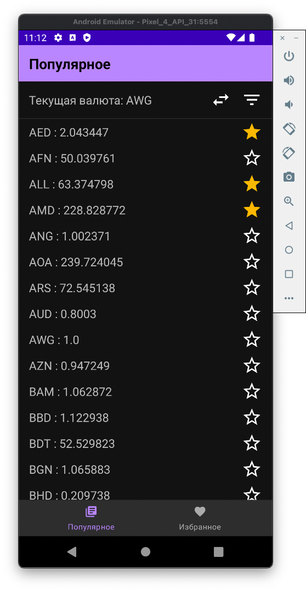
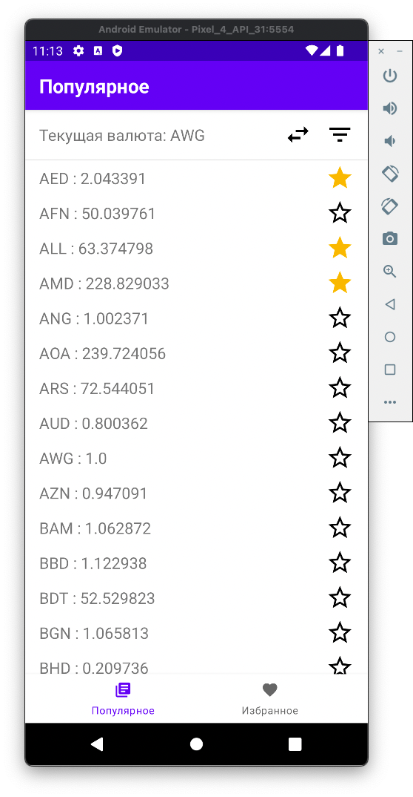
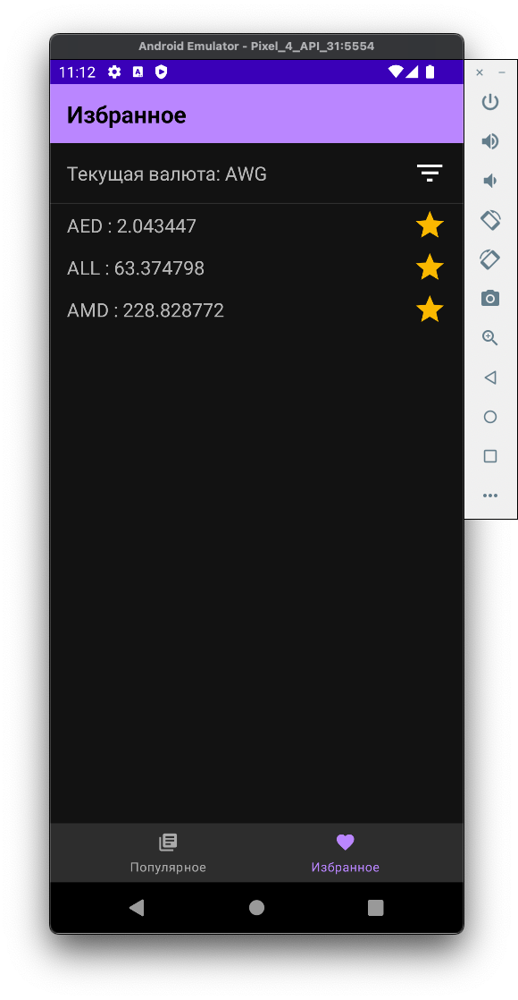
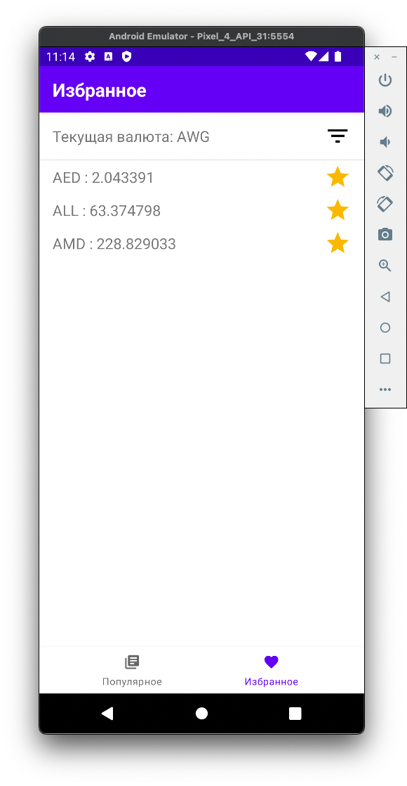
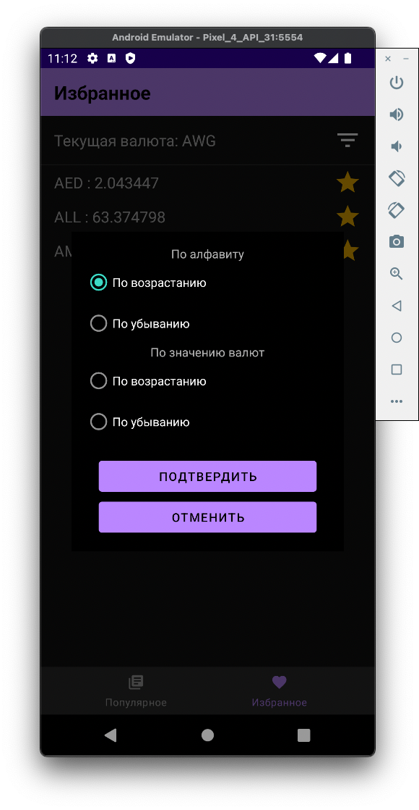
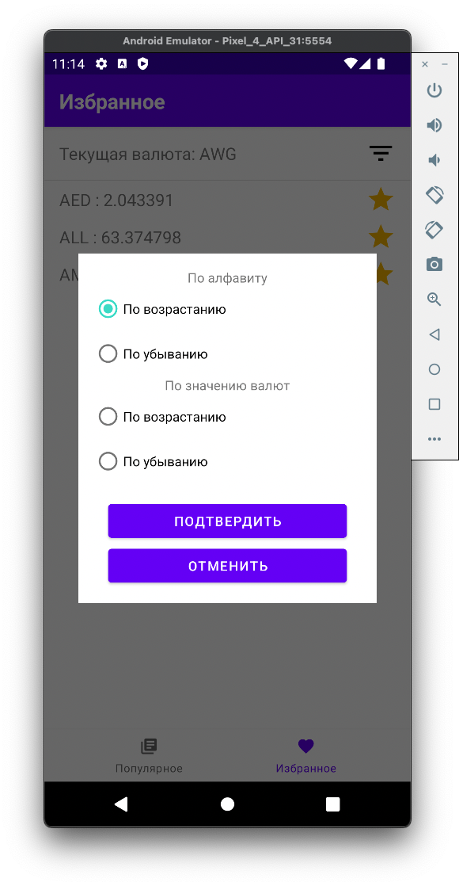
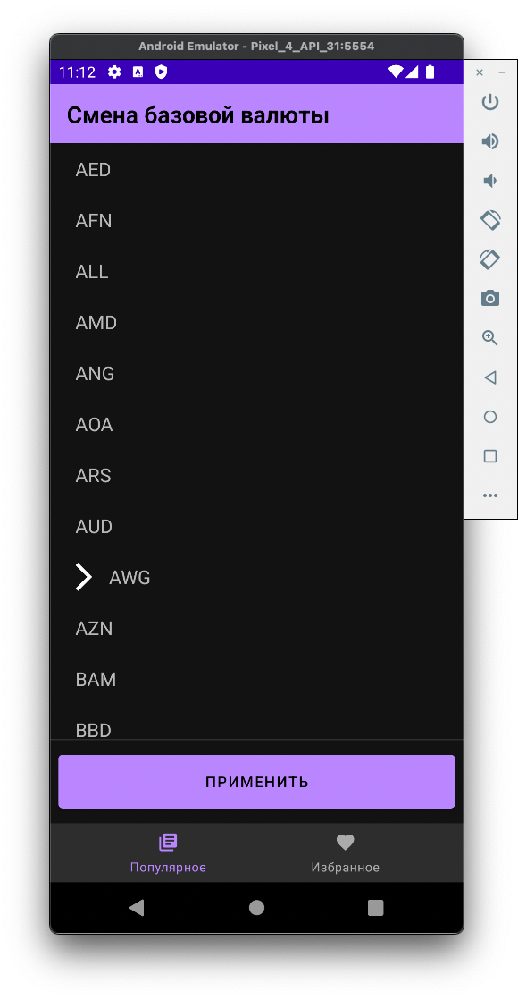
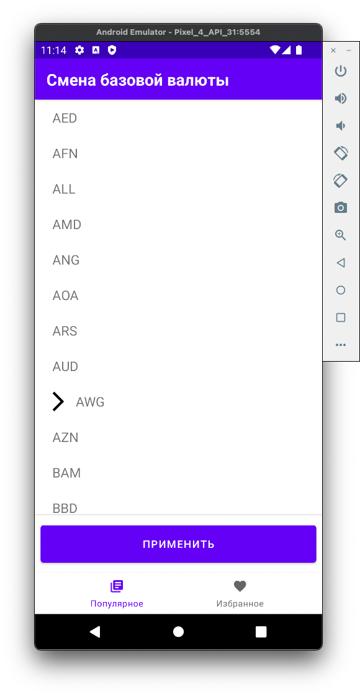

<h2> Тестовое задание для "CCS" </h2>

<h2>Apk находится в папке additional_data/apk/</h2>

<b>Примеры экранов:</b>

   
  

<b>Используемые технологии:</b>

- Kotlin
- MVVM + States
- Kotlin coroutines + Flow
- Retrofit, Moshi
- HILT
- Room
- Cicerone

  <b> При ошибке сети заменить apikey в shared/network/.../RetrofitProvider.kt ([ссылка на файл](./shared/network/src/main/java/com/blizpear/testAppCCS/network/RetrofitProvider.kt)) </b>